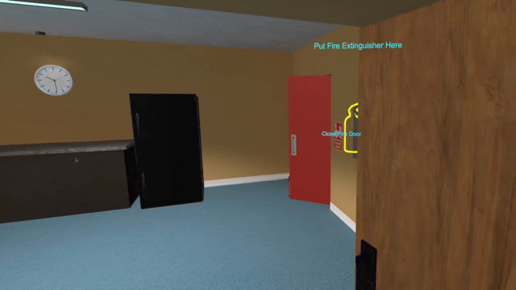
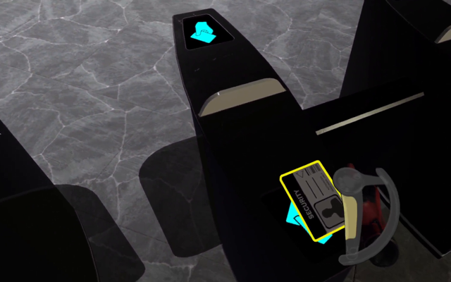
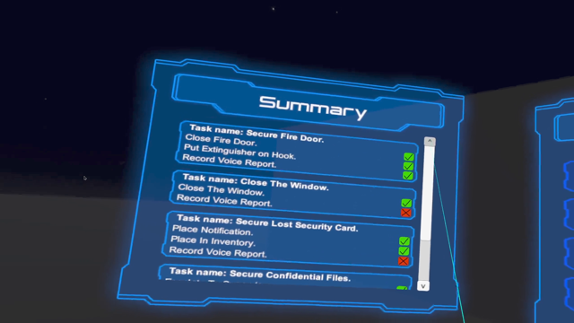
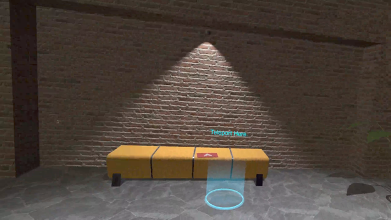
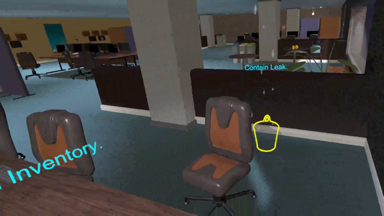
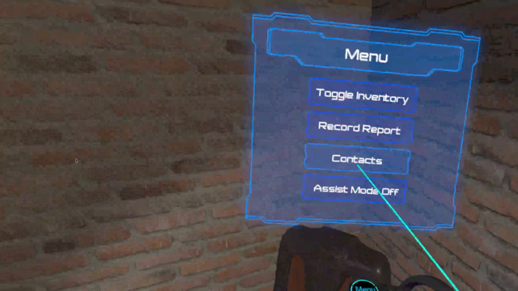

# VR Security Training Simulation

## Demonstration
Video demonstration available here: [https://www.youtube.com/watch?v=iBPsW_D2BDA](https://www.youtube.com/watch?v=iBPsW_D2BDA)

## Description
This project was created as part of a research project with the University of Kent. The purpose of the VR environment is to teach new security guards the basics of a typical patrol. The environment was designed to test the user's situational awareness and understanding of correct procedure.

The training environment was created using Unity and the SteamVR SDK.

Due to nature of the research project, the source code is not available for this project.

### Features

- Individual persistent user profiles and statistics.
- Multiple individual randomised hazards.
- Task management system in which users must complete multiple tasks to complete an object.
- In-game voice recording and playback.
- Instructors can record trainee interaction with simulation as a video file and later review.
- Statistics saved as CSV file for instructors to review later.
- Tutorial system with Text-to-Speech voice.
- Inventory system in which users can add and remove virtual objects from the world around them.

## Screenshots
Inventory system.

Example of a task.

Controller and object highlighting.

Statistics display (also saved to csv).

Example of a task.

Example of a task.

Menu display.

## Attributions

I did not create any of the 3D assets present in the demonstration.

